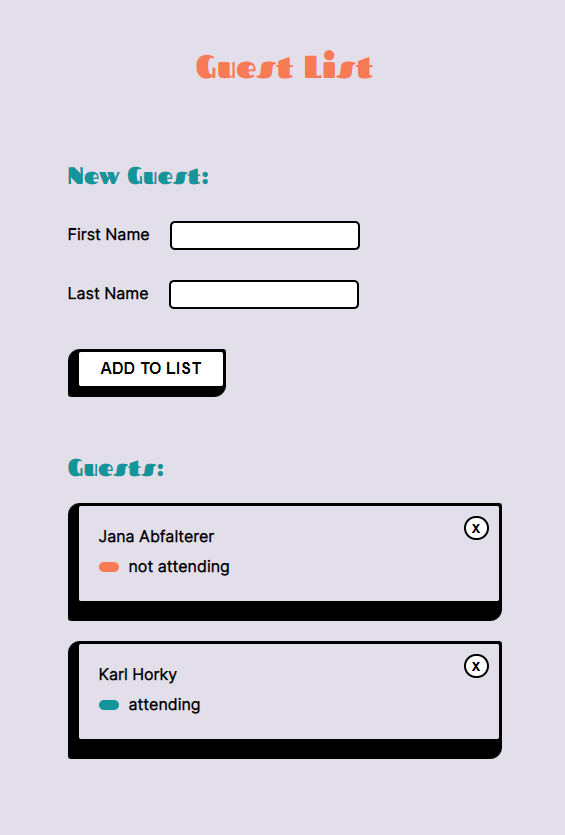

# Guest List

This guest list was built with React.js using the UpLeveled [express-guest-list-api-memory-data-store](https://github.com/upleveled/express-guest-list-api-memory-data-store).



## quick start

- start the dev server: `yarn start`
- start the api:

```cd express-guest-list-api-memory-data-store
yarn start
```

## what it can do

- Add/remove guests
- mark as attending/not attending
- saves guest data in api
